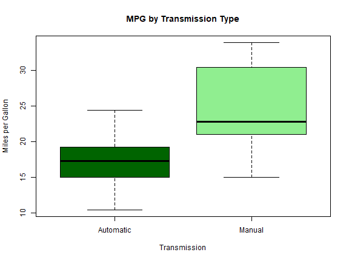
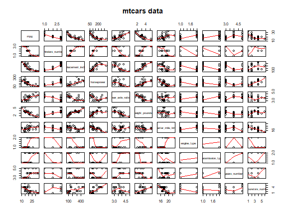

## Executive Summary

Motor Trend, a popular automotive magazine, has expressed an interest in understanding the relationship between miles per gallon (`mpg`) and transmission type (`am`).  
In order to conduct an analysis in this regard, we will leverage the 1974 Motor Trend Car Road Tests, which can be found [here](https://stat.ethz.ch/R-manual/R-devel/library/datasets/html/mtcars.html).
Ultimately, Motor Trend would like to answer two questions:

### 1. Is an automatic or manual transmission better for MPG?
    All other things being equal a manual transmission is more efficient for miles per gallon.
	However when taking into account other variables it is a combination of factors that lead to the optimum result.


### 2. Quantify the MPG difference between automatic and manual transmissions?
	The best fit model is a combination of cylinders numbers, horsepower, weight and transmission to determine miles per gallon.
	This combination of variables accounted for 87% of data variance.

This analysis was conducted as part of the [Coursera Data Science Specialization](https://www.coursera.org/learn/regression-models/peer/nxntd/regression-models-course-project)


----------


## Data import and tidy
First we operate on the data set and given better descriptive names to the columns.
    
 - *vs* = V engine or a straight engine. 0 means a V-engine, and 1 straight engine. 
 - *am* = automatic / manual 0 = automatic, 1 = manual


```r
data(mtcars)
sql1 <- 'select mpg, cyl as cylinders_number, disp as displacement_inches, hp as horsepower, drat as rear_axle_ratio, wt as weight_pounds, '
sql2 <- 'qsec as quarter_mile_time, vs as engine_type, am as transmission_type, gear as gears_number, carb as carburetors_number from mtcars'
data <- sqldf(paste(sql1, sql2))
data <- as_tibble(data)
data$engine_type <- factor(data$engine_type, levels = c(0, 1), labels = c('v_engine', 'straight_engine'))
data$transmission_type <- factor(data$transmission_type, levels = c(0, 1), labels = c('Automatic', 'Manual'))
data$cylinders_number <- factor(data$cylinders_number)
data$carburetors_number <- factor(data$carburetors_number)
```

----------

## Exploratory Analysis

### Conduct a hypothesis test
**H0      transmission_type does not affect miles per gallon**
**H1      transmission_type does affect miles per gallon**
    

> As the variance is not equal between Automatic and Manual rows we use a Welchs
> t-test to determine if transmission_type impacts mpg by inspecting the
> p-value ( alpha = 0.05)


```r
test <- t.test(mpg ~ transmission_type, data = data, var.equal = FALSE, paired = FALSE, conf.level = .95)
test$p.value
```

```
## [1] 0.001373638
```
 0.137%  --> since the p-value is less than alpha (0.05) we reject the null hypothesis and can determine there is a cause / effect between transmission_type and mile per gallon

To visualise the difference between manual vs automatic transmission petrol consumption can we seen 


```r
boxplot(mpg ~ transmission_type, data = data,
        col = c("dark green", "light green"),
        xlab = "Transmission",
        ylab = "Miles per Gallon",
        main = "MPG by Transmission Type")
```


Conclusion:  Comparing just mpg to transmission type it appears manual transmissions are more fuel effective.


----------


Regression Analysis
-------------------


The first model looks at the relationship between  `mpg` and `am` (transmission_type) using 1 predictor


```r
model_1 <- lm(mpg ~ transmission_type, data = data)
summary(model_1)$coeff
```

```
##                          Estimate Std. Error   t value     Pr(>|t|)
## (Intercept)             17.147368   1.124603 15.247492 1.133983e-15
## transmission_typeManual  7.244939   1.764422  4.106127 2.850207e-04
```

```r
summary(model_1)$r.squared
```

```
## [1] 0.3597989
```
Interpreting the coefficients , we see an increase of 7.24 in miles per gallon when using a manual transmission over an automated transmission.

But the R squared value is 36% indicating that this does not explain alot of variability in the data (100% indicates that the model explains all the variability of the response data around its mean)

It appears other confounding variables affect the mpg. 
Collinearity occurs when a predictor is too highly correlated with one or more of the other predictors.
To detect collinearity we first build a model for all variables,then we can assess the collinearity by variance inflation factor(VIF)


```r
model_all <- lm(mpg ~ ., data = data)
vif(model_all)
```

```
##                           GVIF Df GVIF^(1/(2*Df))
## cylinders_number     86.719150  2        3.051608
## displacement_inches  48.416957  1        6.958229
## horsepower           24.426778  1        4.942345
## rear_axle_ratio       6.554458  1        2.560168
## weight_pounds        21.787524  1        4.667711
## quarter_mile_time     9.096264  1        3.016001
## engine_type           6.977657  1        2.641525
## transmission_type     7.020193  1        2.649565
## gears_number          7.033900  1        2.652150
## carburetors_number  282.627306  5        1.758415
```

As we have factorised a number of fields the **GVIF** variables are produced (see appendix) 
GVIF values that are greater than 40 are considered large and polluted.
Any value over 20 should be scrutinised. 

In order to fit the best model in predicting the miles per outcome we use a model selection strategy to find the better combination of variables.

The chosen strategy for model selection is AIC in a Stepwise Algorithm. 
The optimum model is the one with the smallest AIC


```r
model_best <- step(model_all, direction = "both")
```

```
## Start:  AIC=74.41
## mpg ~ cylinders_number + displacement_inches + horsepower + rear_axle_ratio + 
##     weight_pounds + quarter_mile_time + engine_type + transmission_type + 
##     gears_number + carburetors_number
## 
##                       Df Sum of Sq    RSS    AIC
## - carburetors_number   5   14.8472 135.27 68.129
## - quarter_mile_time    1    1.3256 121.75 72.759
## - transmission_type    1    1.3885 121.81 72.776
## - rear_axle_ratio      1    1.8144 122.24 72.887
## - cylinders_number     2   10.9245 131.35 73.188
## - gears_number         1    3.9522 124.38 73.442
## - engine_type          1    3.9754 124.40 73.448
## <none>                             120.42 74.409
## - displacement_inches  1   12.9361 133.36 75.674
## - weight_pounds        1   28.4185 148.84 79.189
## - horsepower           1   29.0432 149.47 79.323
## 
## Step:  AIC=68.13
## mpg ~ cylinders_number + displacement_inches + horsepower + rear_axle_ratio + 
##     weight_pounds + quarter_mile_time + engine_type + transmission_type + 
##     gears_number
## 
##                       Df Sum of Sq    RSS    AIC
## - rear_axle_ratio      1     0.279 135.55 66.195
## - displacement_inches  1     2.363 137.63 66.683
## - engine_type          1     2.714 137.99 66.765
## - gears_number         1     3.752 139.02 67.005
## - cylinders_number     2    12.824 148.09 67.028
## - quarter_mile_time    1     4.569 139.84 67.192
## <none>                             135.27 68.129
## - transmission_type    1    10.764 146.03 68.579
## - horsepower           1    21.834 157.10 70.918
## - weight_pounds        1    31.937 167.21 72.912
## + carburetors_number   5    14.847 120.42 74.409
## 
## Step:  AIC=66.2
## mpg ~ cylinders_number + displacement_inches + horsepower + weight_pounds + 
##     quarter_mile_time + engine_type + transmission_type + gears_number
## 
##                       Df Sum of Sq    RSS    AIC
## - displacement_inches  1     2.225 137.78 64.716
## - engine_type          1     2.851 138.40 64.861
## - quarter_mile_time    1     4.342 139.89 65.204
## - gears_number         1     4.440 139.99 65.227
## - cylinders_number     2    14.269 149.82 65.398
## <none>                             135.55 66.195
## - transmission_type    1    11.509 147.06 66.803
## + rear_axle_ratio      1     0.279 135.27 68.129
## - horsepower           1    22.160 157.71 69.041
## - weight_pounds        1    31.745 167.29 70.929
## + carburetors_number   5    13.312 122.24 72.887
## 
## Step:  AIC=64.72
## mpg ~ cylinders_number + horsepower + weight_pounds + quarter_mile_time + 
##     engine_type + transmission_type + gears_number
## 
##                       Df Sum of Sq    RSS    AIC
## - quarter_mile_time    1     3.191 140.97 63.449
## - engine_type          1     3.341 141.12 63.483
## - gears_number         1     3.463 141.24 63.511
## <none>                             137.78 64.716
## - transmission_type    1    11.535 149.31 65.289
## - cylinders_number     2    21.948 159.72 65.447
## + displacement_inches  1     2.225 135.55 66.195
## + rear_axle_ratio      1     0.142 137.63 66.683
## - horsepower           1    21.505 159.28 67.358
## - weight_pounds        1    37.049 174.82 70.337
## + carburetors_number   5     3.316 134.46 73.937
## 
## Step:  AIC=63.45
## mpg ~ cylinders_number + horsepower + weight_pounds + engine_type + 
##     transmission_type + gears_number
## 
##                       Df Sum of Sq    RSS    AIC
## - gears_number         1     2.714 143.68 62.059
## - engine_type          1     8.733 149.70 63.372
## - transmission_type    1     9.031 150.00 63.436
## <none>                             140.97 63.449
## + quarter_mile_time    1     3.191 137.78 64.716
## + displacement_inches  1     1.074 139.89 65.204
## - cylinders_number     2    27.981 168.95 65.243
## + rear_axle_ratio      1     0.025 140.94 65.443
## - horsepower           1    34.456 175.42 68.447
## - weight_pounds        1    35.907 176.87 68.710
## + carburetors_number   5     5.215 135.75 72.243
## 
## Step:  AIC=62.06
## mpg ~ cylinders_number + horsepower + weight_pounds + engine_type + 
##     transmission_type
## 
##                       Df Sum of Sq    RSS    AIC
## - engine_type          1     7.346 151.03 61.655
## <none>                             143.68 62.059
## - cylinders_number     2    25.284 168.96 63.246
## + gears_number         1     2.714 140.97 63.449
## + quarter_mile_time    1     2.442 141.24 63.511
## - transmission_type    1    16.443 160.12 63.527
## + displacement_inches  1     0.589 143.09 63.928
## + rear_axle_ratio      1     0.330 143.35 63.986
## - horsepower           1    36.344 180.02 67.275
## - weight_pounds        1    41.088 184.77 68.108
## + carburetors_number   5     3.480 140.20 71.275
## 
## Step:  AIC=61.65
## mpg ~ cylinders_number + horsepower + weight_pounds + transmission_type
## 
##                       Df Sum of Sq    RSS    AIC
## <none>                             151.03 61.655
## - transmission_type    1     9.752 160.78 61.657
## + engine_type          1     7.346 143.68 62.059
## + quarter_mile_time    1     7.044 143.98 62.126
## - cylinders_number     2    29.265 180.29 63.323
## + gears_number         1     1.327 149.70 63.372
## + displacement_inches  1     0.617 150.41 63.524
## + rear_axle_ratio      1     0.220 150.81 63.608
## - horsepower           1    31.943 182.97 65.794
## - weight_pounds        1    46.173 197.20 68.191
## + carburetors_number   5     5.633 145.39 70.438
```

**Winner Step:  AIC=61.65 --> mpg ~ cylinders_number + horsepower + weight_pounds + transmission_type**

```r
summary(model_best)$r.squared
```

```
## [1] 0.8658799
```

R squared of 87% indicate a good fit for these variables in computing the miles per gallon. 

## Conclusion

The best fit model is a combination of cylinders numbers, horsepower, weight and transmission to determine miles per gallon.

This combination of variables accounted for 87% of data variance.

## Appendix

Data Table Summary:


```
##       mpg        cylinders_number displacement_inches   horsepower   
##  Min.   :10.40   4:11             Min.   : 71.1       Min.   : 52.0  
##  1st Qu.:15.43   6: 7             1st Qu.:120.8       1st Qu.: 96.5  
##  Median :19.20   8:14             Median :196.3       Median :123.0  
##  Mean   :20.09                    Mean   :230.7       Mean   :146.7  
##  3rd Qu.:22.80                    3rd Qu.:326.0       3rd Qu.:180.0  
##  Max.   :33.90                    Max.   :472.0       Max.   :335.0  
##  rear_axle_ratio weight_pounds   quarter_mile_time          engine_type
##  Min.   :2.760   Min.   :1.513   Min.   :14.50     v_engine       :18  
##  1st Qu.:3.080   1st Qu.:2.581   1st Qu.:16.89     straight_engine:14  
##  Median :3.695   Median :3.325   Median :17.71                         
##  Mean   :3.597   Mean   :3.217   Mean   :17.85                         
##  3rd Qu.:3.920   3rd Qu.:3.610   3rd Qu.:18.90                         
##  Max.   :4.930   Max.   :5.424   Max.   :22.90                         
##  transmission_type  gears_number   carburetors_number
##  Automatic:19      Min.   :3.000   1: 7              
##  Manual   :13      1st Qu.:3.000   2:10              
##                    Median :4.000   3: 3              
##                    Mean   :3.688   4:10              
##                    3rd Qu.:4.000   6: 1              
##                    Max.   :5.000   8: 1
```

Model Variance Summary:


```
## Analysis of Variance Table
## 
## Model 1: mpg ~ transmission_type
## Model 2: mpg ~ cylinders_number + displacement_inches + horsepower + rear_axle_ratio + 
##     weight_pounds + quarter_mile_time + engine_type + transmission_type + 
##     gears_number + carburetors_number
## Model 3: mpg ~ cylinders_number + horsepower + weight_pounds + transmission_type
##   Res.Df    RSS  Df Sum of Sq      F    Pr(>F)    
## 1     30 720.90                                   
## 2     16 120.42  14    600.47 5.6987 0.0006982 ***
## 3     26 151.03 -10    -30.60 0.4066 0.9238990    
## ---
## Signif. codes:  0 '***' 0.001 '**' 0.01 '*' 0.05 '.' 0.1 ' ' 1
```

Pairs Visual:



|  mpg|cylinders_number | displacement_inches| horsepower| rear_axle_ratio| weight_pounds| quarter_mile_time|engine_type     |transmission_type | gears_number|carburetors_number |
|----:|:----------------|-------------------:|----------:|---------------:|-------------:|-----------------:|:---------------|:-----------------|------------:|:------------------|
| 21.0|6                |               160.0|        110|            3.90|         2.620|             16.46|v_engine        |Manual            |            4|4                  |
| 21.0|6                |               160.0|        110|            3.90|         2.875|             17.02|v_engine        |Manual            |            4|4                  |
| 22.8|4                |               108.0|         93|            3.85|         2.320|             18.61|straight_engine |Manual            |            4|1                  |
| 21.4|6                |               258.0|        110|            3.08|         3.215|             19.44|straight_engine |Automatic         |            3|1                  |
| 18.7|8                |               360.0|        175|            3.15|         3.440|             17.02|v_engine        |Automatic         |            3|2                  |
| 18.1|6                |               225.0|        105|            2.76|         3.460|             20.22|straight_engine |Automatic         |            3|1                  |
| 14.3|8                |               360.0|        245|            3.21|         3.570|             15.84|v_engine        |Automatic         |            3|4                  |
| 24.4|4                |               146.7|         62|            3.69|         3.190|             20.00|straight_engine |Automatic         |            4|2                  |
| 22.8|4                |               140.8|         95|            3.92|         3.150|             22.90|straight_engine |Automatic         |            4|2                  |
| 19.2|6                |               167.6|        123|            3.92|         3.440|             18.30|straight_engine |Automatic         |            4|4                  |
| 17.8|6                |               167.6|        123|            3.92|         3.440|             18.90|straight_engine |Automatic         |            4|4                  |
| 16.4|8                |               275.8|        180|            3.07|         4.070|             17.40|v_engine        |Automatic         |            3|3                  |
| 17.3|8                |               275.8|        180|            3.07|         3.730|             17.60|v_engine        |Automatic         |            3|3                  |
| 15.2|8                |               275.8|        180|            3.07|         3.780|             18.00|v_engine        |Automatic         |            3|3                  |
| 10.4|8                |               472.0|        205|            2.93|         5.250|             17.98|v_engine        |Automatic         |            3|4                  |
| 10.4|8                |               460.0|        215|            3.00|         5.424|             17.82|v_engine        |Automatic         |            3|4                  |
| 14.7|8                |               440.0|        230|            3.23|         5.345|             17.42|v_engine        |Automatic         |            3|4                  |
| 32.4|4                |                78.7|         66|            4.08|         2.200|             19.47|straight_engine |Manual            |            4|1                  |
| 30.4|4                |                75.7|         52|            4.93|         1.615|             18.52|straight_engine |Manual            |            4|2                  |
| 33.9|4                |                71.1|         65|            4.22|         1.835|             19.90|straight_engine |Manual            |            4|1                  |
| 21.5|4                |               120.1|         97|            3.70|         2.465|             20.01|straight_engine |Automatic         |            3|1                  |
| 15.5|8                |               318.0|        150|            2.76|         3.520|             16.87|v_engine        |Automatic         |            3|2                  |
| 15.2|8                |               304.0|        150|            3.15|         3.435|             17.30|v_engine        |Automatic         |            3|2                  |
| 13.3|8                |               350.0|        245|            3.73|         3.840|             15.41|v_engine        |Automatic         |            3|4                  |
| 19.2|8                |               400.0|        175|            3.08|         3.845|             17.05|v_engine        |Automatic         |            3|2                  |
| 27.3|4                |                79.0|         66|            4.08|         1.935|             18.90|straight_engine |Manual            |            4|1                  |
| 26.0|4                |               120.3|         91|            4.43|         2.140|             16.70|v_engine        |Manual            |            5|2                  |
| 30.4|4                |                95.1|        113|            3.77|         1.513|             16.90|straight_engine |Manual            |            5|2                  |
| 15.8|8                |               351.0|        264|            4.22|         3.170|             14.50|v_engine        |Manual            |            5|4                  |
| 19.7|6                |               145.0|        175|            3.62|         2.770|             15.50|v_engine        |Manual            |            5|6                  |
| 15.0|8                |               301.0|        335|            3.54|         3.570|             14.60|v_engine        |Manual            |            5|8                  |
| 21.4|4                |               121.0|        109|            4.11|         2.780|             18.60|straight_engine |Manual            |            4|2                  |

##GVIF
GVIF represents the squared ratio of hypervolumes of the joint-confidence ellipsoid for a subset of coefficients to the "utopian" ellipsoid that would be obtained if the regressors in this subset were uncorrelated with regressors in the complementary subset. In the case of a single coefficient, this specializes to the usual VIF
https://stats.stackexchange.com/questions/70679/which-variance-inflation-factor-should-i-be-using-textgvif-or-textgvif/96584#96584
