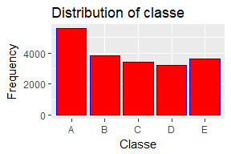

# Coursera Practical Machine Learning -  Prediction Assignment
Chris McKelt  
17 September 2017  
# Introduction

This is an analysis for final assignment of the Coursea course 'Practical Machine Learning'.

http://web.archive.org/web/20161224072740/http:/groupware.les.inf.puc-rio.br/har


#Executive summary

A random forest model achieved the best prediction.

The Random Forest algorithm is less susceptible to overfitting unlike the Gradient Boosting Machines (GBMs) algorithm.

# Background

Using devices such as Jawbone Up, Nike FuelBand, and Fitbit it is now possible to collect a large amount of data about personal activity relatively inexpensively. 
These type of devices are part of the quantified self movement - a group of enthusiasts who take measurements about themselves regularly to improve their health, to find patterns in their behavior, or because they are tech geeks. One thing that people regularly do is quantify how much of a particular activity they do, but they rarely quantify how well they do it. In this project, your goal will be to use data from accelerometers on the belt, forearm, arm, and dumbell of 6 participants. They were asked to perform barbell lifts correctly and incorrectly in 5 different ways. More information is available from the website here: http://groupware.les.inf.puc-rio.br/har (see the section on the Weight Lifting Exercise Dataset).

The exercises were performed by six male participants aged between 20-28 years, with little weight lifting experience. 

Class A corresponds to the specified execution of the exercise, while the other 4 classes correspond to common mistakes. 

## Goal

Predict the manner in which a participant did the exercise (class A - properly - or any other incorrect way)

# Data
## Obtaining Data
The training data for this project are available here: https://d396qusza40orc.cloudfront.net/predmachlearn/pml-training.csv

The test data are available here: https://d396qusza40orc.cloudfront.net/predmachlearn/pml-testing.csv


```r
using <- function(packageName) {
    if (!require(packageName, character.only = TRUE) && !(packageName %in% installed.packages())) {
        install.packages(dput(packageName), dependencies = TRUE, quiet = FALSE)
    }

   library(packageName, character.only = TRUE)
}

save_file = function(url, name) {
    if (!file.exists(name)) {
        library(downloader)
        download(url, destfile = name)
    }
}
using("sqldf")
using("readr")
using("caret")
using("randomForest")
using("ROCR")
using("pROC")
using("parallel")
using("doParallel")
string40 <- "ncnnccnnnnnnnnnnnnnnnnnnnnnnnnnnnnnnnnnn"
string80 <- "nnnnnnnnnnnnnnnnnnnnnnnnnnnnnnnnnnnnnnnn"
string120 <- "nnnnnnnnnnnnnnnnnnnnnnnnnnnnnnnnnnnnnnnn"
string160 <- "nnnnnnnnnnnnnnnnnnnnnnnnnnnnnnnnnnnnnnnc"
colString <- paste(string40, string80, string120, string160, sep = "")

save_file("https://d396qusza40orc.cloudfront.net/predmachlearn/pml-training.csv", "pml-training.csv")
save_file("https://d396qusza40orc.cloudfront.net/predmachlearn/pml-testing.csv", "pml-testing.csv")
training <- readr::read_csv("pml-training.csv", col_names = TRUE, col_types = colString)
testing <- readr::read_csv("pml-testing.csv", col_names = TRUE, col_types = colString)
training <- as.data.frame(training)
training <- training[, order(names(training))]
testing <- testing[, order(names(testing))]
set.seed(333)
```
## Data Exploration

The goal of this project is to predict the manner in which they did the exercise. 
This is the "classe" variable in the training set, the last column. Let's have a look at the training data. 

```r
dim(training)
```

```
## [1] 19622   160
```

```r
dim(testing)
```

```
## [1]  20 160
```

```r
levels(training$classe)
```

```
## NULL
```

```r
names(training)
```

```
##   [1] "accel_arm_x"              "accel_arm_y"             
##   [3] "accel_arm_z"              "accel_belt_x"            
##   [5] "accel_belt_y"             "accel_belt_z"            
##   [7] "accel_dumbbell_x"         "accel_dumbbell_y"        
##   [9] "accel_dumbbell_z"         "accel_forearm_x"         
##  [11] "accel_forearm_y"          "accel_forearm_z"         
##  [13] "amplitude_pitch_arm"      "amplitude_pitch_belt"    
##  [15] "amplitude_pitch_dumbbell" "amplitude_pitch_forearm" 
##  [17] "amplitude_roll_arm"       "amplitude_roll_belt"     
##  [19] "amplitude_roll_dumbbell"  "amplitude_roll_forearm"  
##  [21] "amplitude_yaw_arm"        "amplitude_yaw_belt"      
##  [23] "amplitude_yaw_dumbbell"   "amplitude_yaw_forearm"   
##  [25] "avg_pitch_arm"            "avg_pitch_belt"          
##  [27] "avg_pitch_dumbbell"       "avg_pitch_forearm"       
##  [29] "avg_roll_arm"             "avg_roll_belt"           
##  [31] "avg_roll_dumbbell"        "avg_roll_forearm"        
##  [33] "avg_yaw_arm"              "avg_yaw_belt"            
##  [35] "avg_yaw_dumbbell"         "avg_yaw_forearm"         
##  [37] "classe"                   "cvtd_timestamp"          
##  [39] "gyros_arm_x"              "gyros_arm_y"             
##  [41] "gyros_arm_z"              "gyros_belt_x"            
##  [43] "gyros_belt_y"             "gyros_belt_z"            
##  [45] "gyros_dumbbell_x"         "gyros_dumbbell_y"        
##  [47] "gyros_dumbbell_z"         "gyros_forearm_x"         
##  [49] "gyros_forearm_y"          "gyros_forearm_z"         
##  [51] "kurtosis_picth_arm"       "kurtosis_picth_belt"     
##  [53] "kurtosis_picth_dumbbell"  "kurtosis_picth_forearm"  
##  [55] "kurtosis_roll_arm"        "kurtosis_roll_belt"      
##  [57] "kurtosis_roll_dumbbell"   "kurtosis_roll_forearm"   
##  [59] "kurtosis_yaw_arm"         "kurtosis_yaw_belt"       
##  [61] "kurtosis_yaw_dumbbell"    "kurtosis_yaw_forearm"    
##  [63] "magnet_arm_x"             "magnet_arm_y"            
##  [65] "magnet_arm_z"             "magnet_belt_x"           
##  [67] "magnet_belt_y"            "magnet_belt_z"           
##  [69] "magnet_dumbbell_x"        "magnet_dumbbell_y"       
##  [71] "magnet_dumbbell_z"        "magnet_forearm_x"        
##  [73] "magnet_forearm_y"         "magnet_forearm_z"        
##  [75] "max_picth_arm"            "max_picth_belt"          
##  [77] "max_picth_dumbbell"       "max_picth_forearm"       
##  [79] "max_roll_arm"             "max_roll_belt"           
##  [81] "max_roll_dumbbell"        "max_roll_forearm"        
##  [83] "max_yaw_arm"              "max_yaw_belt"            
##  [85] "max_yaw_dumbbell"         "max_yaw_forearm"         
##  [87] "min_pitch_arm"            "min_pitch_belt"          
##  [89] "min_pitch_dumbbell"       "min_pitch_forearm"       
##  [91] "min_roll_arm"             "min_roll_belt"           
##  [93] "min_roll_dumbbell"        "min_roll_forearm"        
##  [95] "min_yaw_arm"              "min_yaw_belt"            
##  [97] "min_yaw_dumbbell"         "min_yaw_forearm"         
##  [99] "new_window"               "num_window"              
## [101] "pitch_arm"                "pitch_belt"              
## [103] "pitch_dumbbell"           "pitch_forearm"           
## [105] "raw_timestamp_part_1"     "raw_timestamp_part_2"    
## [107] "roll_arm"                 "roll_belt"               
## [109] "roll_dumbbell"            "roll_forearm"            
## [111] "skewness_pitch_arm"       "skewness_pitch_dumbbell" 
## [113] "skewness_pitch_forearm"   "skewness_roll_arm"       
## [115] "skewness_roll_belt"       "skewness_roll_belt.1"    
## [117] "skewness_roll_dumbbell"   "skewness_roll_forearm"   
## [119] "skewness_yaw_arm"         "skewness_yaw_belt"       
## [121] "skewness_yaw_dumbbell"    "skewness_yaw_forearm"    
## [123] "stddev_pitch_arm"         "stddev_pitch_belt"       
## [125] "stddev_pitch_dumbbell"    "stddev_pitch_forearm"    
## [127] "stddev_roll_arm"          "stddev_roll_belt"        
## [129] "stddev_roll_dumbbell"     "stddev_roll_forearm"     
## [131] "stddev_yaw_arm"           "stddev_yaw_belt"         
## [133] "stddev_yaw_dumbbell"      "stddev_yaw_forearm"      
## [135] "total_accel_arm"          "total_accel_belt"        
## [137] "total_accel_dumbbell"     "total_accel_forearm"     
## [139] "user_name"                "var_accel_arm"           
## [141] "var_accel_dumbbell"       "var_accel_forearm"       
## [143] "var_pitch_arm"            "var_pitch_belt"          
## [145] "var_pitch_dumbbell"       "var_pitch_forearm"       
## [147] "var_roll_arm"             "var_roll_belt"           
## [149] "var_roll_dumbbell"        "var_roll_forearm"        
## [151] "var_total_accel_belt"     "var_yaw_arm"             
## [153] "var_yaw_belt"             "var_yaw_dumbbell"        
## [155] "var_yaw_forearm"          "X1"                      
## [157] "yaw_arm"                  "yaw_belt"                
## [159] "yaw_dumbbell"             "yaw_forearm"
```

```r
training$classe = as.factor(training$classe)
```

## “classe” variable is the one we are trying to predict

```r
levels(training$classe)
```

```
## [1] "A" "B" "C" "D" "E"
```

<!-- -->

## Cleaning Data
#### remove columns where ALL values are NA --> https://stackoverflow.com/questions/2643939/remove-columns-from-dataframe-where-all-values-are-na

```r
training <- training[, colSums(is.na(training)) == 0]
testing <- testing[, colSums(is.na(testing)) == 0]
dim(training)
```

```
## [1] 19622    60
```

```r
dim(testing)
```

```
## [1] 20 60
```

## Training 
#### split the original training set because original test set does not have enough observations

```r
data.include <- createDataPartition(training$classe, p = .70, list = FALSE)
data.train <- training[data.include,]
data.test <- training[-data.include,]
```

# Model build - Random Forest
speed up randow forest --> see https: / / github.com / lgreski / datasciencectacontent / blob / master / markdown / pml - randomForestPerformance.md

For this random forest model, we apply cross validation: the data is being splitted into five parts, each of them taking the role of a validation set once. A model is built five times on the remaining data, and the classification error is computed on the validation set. The average of these five error rates is our final error. This can all be implemented using the caret train function. We set the seed as the sampling happens randomly.

```r
cat("random forest model started")
```

```
## random forest model started
```

```r
cluster <- makeCluster(detectCores() - 1) # convention to leave 1 core for OS
registerDoParallel(cluster)
fitControl <- trainControl(method = "cv",
                           number = 3,
                           allowParallel = TRUE)
timer.start <- Sys.time()
model.rf <- train(classe ~ ., data = data.train, method = "rf", trControl = fitControl, verbose = FALSE, na.action = na.omit)
timer.end <- Sys.time()
stopCluster(cluster)
registerDoSEQ()
paste("random forest took: ", timer.end - timer.start, attr(timer.end - timer.start, "units"))
```

```
## [1] "random forest took:  1.75783733526866 mins"
```

# Prediction - Random Forest

```r
prediction.rf <- predict(model.rf, training, probability = TRUE)
confusion_matrix.rf <- confusionMatrix(prediction.rf, training$classe)
confusion_matrix.rf
```

```
## Confusion Matrix and Statistics
## 
##           Reference
## Prediction    A    B    C    D    E
##          A 5579    0    0    0    0
##          B    1 3796    0    0    0
##          C    0    1 3422    0    0
##          D    0    0    0 3216    0
##          E    0    0    0    0 3607
## 
## Overall Statistics
##                                      
##                Accuracy : 0.9999     
##                  95% CI : (0.9996, 1)
##     No Information Rate : 0.2844     
##     P-Value [Acc > NIR] : < 2.2e-16  
##                                      
##                   Kappa : 0.9999     
##  Mcnemar's Test P-Value : NA         
## 
## Statistics by Class:
## 
##                      Class: A Class: B Class: C Class: D Class: E
## Sensitivity            0.9998   0.9997   1.0000   1.0000   1.0000
## Specificity            1.0000   0.9999   0.9999   1.0000   1.0000
## Pos Pred Value         1.0000   0.9997   0.9997   1.0000   1.0000
## Neg Pred Value         0.9999   0.9999   1.0000   1.0000   1.0000
## Prevalence             0.2844   0.1935   0.1744   0.1639   0.1838
## Detection Rate         0.2843   0.1935   0.1744   0.1639   0.1838
## Detection Prevalence   0.2843   0.1935   0.1744   0.1639   0.1838
## Balanced Accuracy      0.9999   0.9998   1.0000   1.0000   1.0000
```

# Model build - Gradient Boosting Machine
Now we will do exactly the same, but use boosting instead of random forests. Getting the accuracy, predications... works with the same code.

```r
cat("boosted model started")
```

```
## boosted model started
```

```r
fitControl2 <- trainControl(method="cv",number=5,allowParallel=TRUE)
timer.start <- Sys.time()
model.gbm <- train(classe ~ ., data = data.train, method = "gbm", trControl = fitControl2, verbose = FALSE, na.action = na.omit)
timer.end <- Sys.time()
paste("boosted took: ", timer.end - timer.start, attr(timer.end - timer.start, "units"))
```

```
## [1] "boosted took:  5.409543800354 mins"
```
  
# Prediction - Gradient Boosting Machine

```r
cat("boosted predictions")
```

```
## boosted predictions
```

```r
prediction.gbm <- predict(model.gbm, training, probability = TRUE)
confusion_matrix.gbm <- confusionMatrix(prediction.gbm, training$classe)
confusion_matrix.gbm
```

```
## Confusion Matrix and Statistics
## 
##           Reference
## Prediction    A    B    C    D    E
##          A 5579    0    0    0    0
##          B    1 3796    0    0    0
##          C    0    1 3422    0    0
##          D    0    0    0 3216    0
##          E    0    0    0    0 3607
## 
## Overall Statistics
##                                      
##                Accuracy : 0.9999     
##                  95% CI : (0.9996, 1)
##     No Information Rate : 0.2844     
##     P-Value [Acc > NIR] : < 2.2e-16  
##                                      
##                   Kappa : 0.9999     
##  Mcnemar's Test P-Value : NA         
## 
## Statistics by Class:
## 
##                      Class: A Class: B Class: C Class: D Class: E
## Sensitivity            0.9998   0.9997   1.0000   1.0000   1.0000
## Specificity            1.0000   0.9999   0.9999   1.0000   1.0000
## Pos Pred Value         1.0000   0.9997   0.9997   1.0000   1.0000
## Neg Pred Value         0.9999   0.9999   1.0000   1.0000   1.0000
## Prevalence             0.2844   0.1935   0.1744   0.1639   0.1838
## Detection Rate         0.2843   0.1935   0.1744   0.1639   0.1838
## Detection Prevalence   0.2843   0.1935   0.1744   0.1639   0.1838
## Balanced Accuracy      0.9999   0.9998   1.0000   1.0000   1.0000
```

